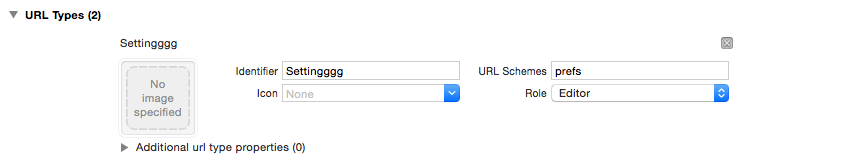
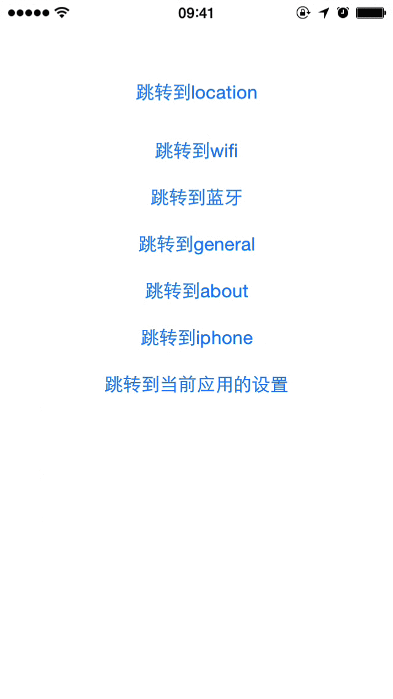

#Setting


描述：ios 应用跳转到设置页面，包含定位，蓝牙，wifi等


- 添加URL Types 
添加URL Schemes 为 **profs**


- 添加代码


```
import UIKit

class ViewController: UIViewController {
    
    private var arr :[String] = []
    
    override func viewDidLoad() {
        super.viewDidLoad()
        // Do any additional setup after loading the view, typically from a nib.
        arr.append("prefs:root=LOCATION_SERVICES")
        arr.append("prefs:root=WIFI")
        arr.append("prefs:root=Bluetooth")
        arr.append("prefs:root=General")
        arr.append("prefs:root=General&path=About")
        arr.append("prefs:root=Phone")
        arr.append("prefs:root=DEVELOPER")
    }
    
    override func didReceiveMemoryWarning() {
        super.didReceiveMemoryWarning()
        // Dispose of any resources that can be recreated.
    }
    
    
    @IBAction func execAction(sender: UIButton) {
        
        UIApplication.sharedApplication().openURL(NSURL(string: arr[sender.tag])!)

    }
    
}

```

- 效果如下
 


- 更多 URL 代码：


```
蜂窝网络：prefs:root=MOBILE_DATA_SETTINGS_ID
VPN — prefs:root=General&path=Network/VPN
Wi-Fi：prefs:root=WIFI
定位服务：prefs:root=LOCATION_SERVICES
个人热点：prefs:root=INTERNET_TETHERING
关于本机：prefs:root=General&path=About
辅助功能：prefs:root=General&path=ACCESSIBILITY
飞行模式：prefs:root=AIRPLANE_MODE
锁定：prefs:root=General&path=AUTOLOCK
亮度：prefs:root=Brightness
蓝牙：prefs:root=General&path=Bluetooth
时间设置：prefs:root=General&path=DATE_AND_TIME
FaceTime：prefs:root=FACETIME
设置：prefs:root=General
键盘设置：prefs:root=General&path=Keyboard
iCloud：prefs:root=CASTLE
iCloud备份：prefs:root=CASTLE&path=STORAGE_AND_BACKUP
语言：prefs:root=General&path=INTERNATIONAL
定位：prefs:root=LOCATION_SERVICES
音乐：prefs:root=MUSIC
Music Equalizer — prefs:root=MUSIC&path=EQ
Music Volume Limit — prefs:root=MUSIC&path=VolumeLimit
Network — prefs:root=General&path=Network
Nike + iPod — prefs:root=NIKE_PLUS_IPOD
Notes — prefs:root=NOTES
Notification — prefs:root=NOTIFICATIONS_ID
Phone — prefs:root=Phone
Photos — prefs:root=Photos
Profile — prefs:root=General&path=ManagedConfigurationList
Reset — prefs:root=General&path=Reset
Safari — prefs:root=Safari
Siri — prefs:root=General&path=Assistant
Sounds — prefs:root=Sounds
Software Update — prefs:root=General&path=SOFTWARE_UPDATE_LINK
Store — prefs:root=STORE
Twitter — prefs:root=TWITTER
Usage — prefs:root=General&path=USAGE
Wallpaper — prefs:root=Wallpaper

```

